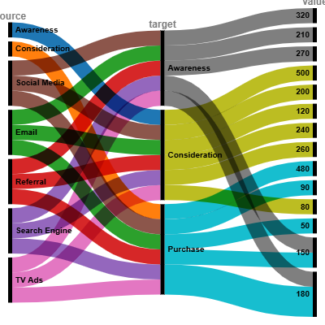

# Market Research Analytics – Customer Journey Alluvial Diagram

**Author:** 23f1002151@ds.study.iitm.ac.in  

## 📌 Business Context
A major retail client wanted to analyze the **customer journey** from awareness to purchase across multiple channels.  
Traditional bar and pie charts cannot capture the **flow of customers between touchpoints**.  
An **Alluvial Diagram** provides a clear and intuitive way to visualize these flows.  

## 📊 Dataset
We simulated realistic customer movement data (15+ rows) with the structure:

| source       | target        | value |
|--------------|--------------|-------|
| Social Media | Awareness    | 320   |
| Email        | Awareness    | 210   |
| Referral     | Awareness    | 180   |
| Search Engine| Awareness    | 270   |
| TV Ads       | Awareness    | 150   |
| Awareness    | Consideration| 500   |
| Consideration| Purchase     | 480   |
| ...          | ...          | ...   |

This captures flows from marketing channels → awareness → consideration → purchase.

---

## 📈 Visualization
The Alluvial Diagram below was created in **RAWGraphs**, mapping source → target → value:

- Colors distinguish channels (Social Media, Email, Referral, etc.).
- Flow widths represent customer volume.  
- Key insights:  
  - **Email and Search Engine drive most conversions**.  
  - **TV Ads create awareness but low purchases**, suggesting inefficiency.  
  - **Social Media plays a strong awareness role but lower final conversions**.  

---

## 🚀 Insights & Recommendations
1. **Boost Email & Search Engine investment** – they have the strongest purchase impact.  
2. **Reassess TV Ads budget** – high awareness but low ROI in purchases.  
3. **Strengthen Social Media retargeting** – good at awareness, needs better conversion tactics.  

---

📧 **Contact:** 23f1002151@ds.study.iitm.ac.in
